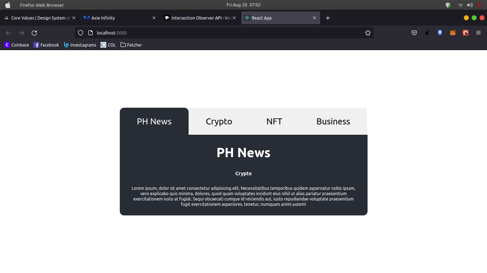

# Directional Mounting/Unmounting transitions (Tabs)

This code is demo on directional transition when html element is unmounting and mouting from the dom. This utilize framer-motion as transition effect, used react lifecycle.

### Author: [Daniel Lozada](https://github.com/adazol123)